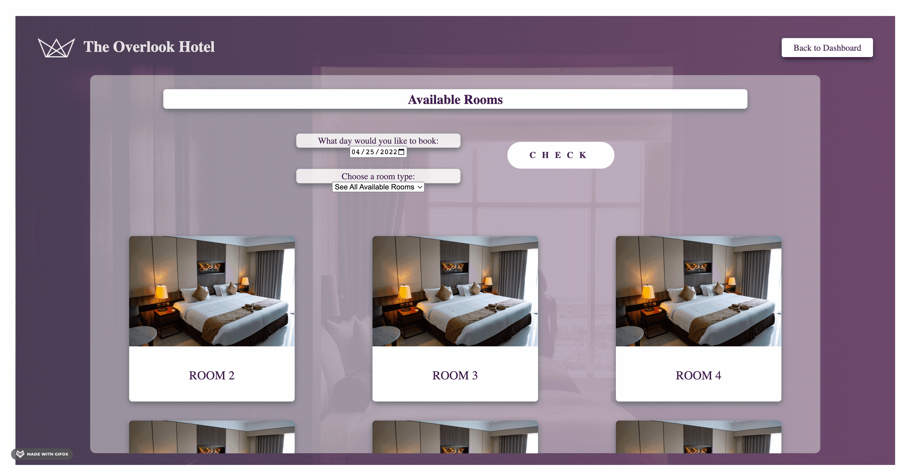

# The Overlook Hotel

## Table of Contents

- [Overview](#overview)  
- [Contributor](#contributor)  
- [Technologies Used](#technologies-used)  
- [Application In Use](#application-in-use)  
- [Instructions](#instructions)  
- [Deploy Link](#deploy-link)

## Overview
A booking website for a fictional hotel name The Overlook

Complete with a dashboard where each user can see all bookings, past and future, as well as the ability to book new reservations.

## Contributor

- Zachary Saile

## Technologies Used

- HTML
- CSS
- Javascript

## Application In Used

#### Here you can log in to see your personalized dashboard

#### Here you can navigate your dashboard, and cancel any upcoming bookings

#### Here you can navigate to the booking page where you can book a new room

##### Here you can refine your search to specific dates and room types

##### Here you can navigate back to the dashboard to see your new booking

## Instructions

0. Running `export NODE_OPTIONS=--openssl-legacy-provider` in the CLI is required to run app locally

1. Press the sign in button to be taken to the sign in page

2. Enter your username (customer + any number 01-50) and password (overlook2021)

3. Press Sign In to access the user dashboard where you can see all past and future reservations

4. The dashboard also allows you to cancel any upcoming reservations

5. Press the Make A New Reservation button to be taken to a page where you can reserve new rooms

6. Refine your search results by date and room type and press Check

7. Hover over a room to see its details, and when you are ready to book, press Book

8. Press the Back to Dashboard button to return to the dashboard and see the reservation you have made

## Deploy Link

[Click Here To See The Overlook Hotel](https://zwsaile.github.io/overlook-hotel/)
